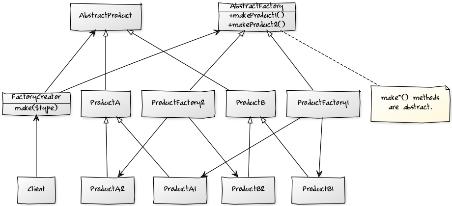

# AbstractFactory

Maka himo cya og multiple object.

## UML  



```
[AbstractProduct]^-[ProductB]
[ProductB]^-[ProductB1]
[ProductB]^-[ProductB2]
[AbstractProduct]^-[ProductA]
[ProductA]^-[ProductA1]
[ProductA]^-[ProductA2]
[AbstractFactory|+makeProduct1();+makeProduct2()]-[note: make*() methods are abstract.{bg:cornsilk}]
[AbstractFactory|+makeProduct1();+makeProduct2()]^-[ProductFactory1]
[AbstractFactory|+makeProduct1();+makeProduct2()]^-[ProductFactory2]
[AbstractFactory|+makeProduct1();+makeProduct2()]<-[FactoryCreator|make($type)]
[AbstractProduct]<-[FactoryCreator|make($type)]
[FactoryCreator|make($type)]<-[Client]
[ProductFactory1]->[ProductA1]
[ProductFactory1]->[ProductB1]
[ProductFactory2]->[ProductA2]
[ProductFactory2]->[ProductB2]
```
